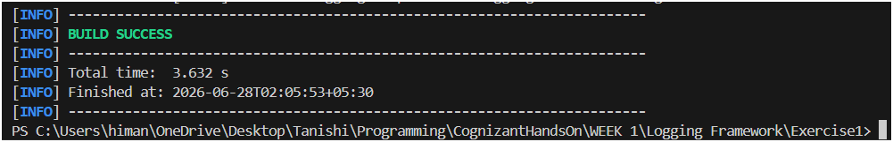
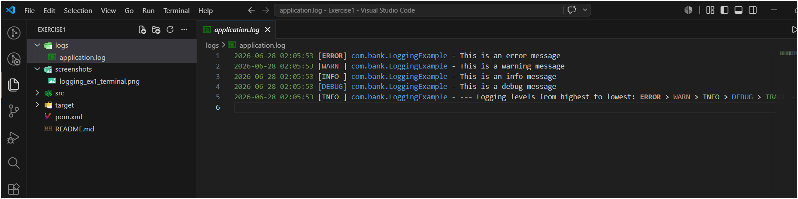

# Logging Framework Exercise 1: Logging Error Messages and Warning Levels

This exercise introduces SLF4J and Logback for logging in Java. The idea is that instead of using `System.out.println()` everywhere to debug or track what the app is doing, you use a proper logging framework that lets you control what gets printed, what level it is, and where it goes (console, file, both).

Same VS Code + Maven setup as previous exercises.

---

## Files in this Folder

- `pom.xml` – Maven project with SLF4J API and Logback dependencies.
- `src/main/java/com/bank/LoggingExample.java` – The main class demonstrating all logging levels.
- `src/main/resources/logback.xml` – Logback configuration file that controls log format, level filter, and output destinations (console + file).

---

## What is SLF4J and Logback

**SLF4J** (Simple Logging Facade for Java) is just the API — it defines the `Logger` interface and the logging methods (`logger.error()`, `logger.warn()` etc.) that your code calls. It's not the actual logger itself, just the "front door."

**Logback** is the actual implementation that does the real work behind the scenes — formats the message, decides whether to print it based on the configured level, and writes it to the console or file.

The reason they're two separate things is flexibility — you can swap Logback for a different implementation (like Log4j) without changing a single line of your application code. Your code only ever talks to the SLF4J API, never directly to Logback.

### Logging Levels (highest to lowest priority)

| Level | When to use it |
|-------|---------------|
| `ERROR` | Something broke, needs immediate attention — DB down, payment failed |
| `WARN` | Unexpected but recoverable — missing config, slow response |
| `INFO` | Normal events worth tracking — server started, user logged in |
| `DEBUG` | Detailed info for development — variable values, method steps |
| `TRACE` | Most granular — method entry/exit, fine-grained tracing |

The root level in `logback.xml` acts as a filter. If set to `DEBUG`, all levels from DEBUG upward are shown (DEBUG, INFO, WARN, ERROR). If set to `WARN`, only WARN and ERROR appear. TRACE is below DEBUG so it would only show if root level is set to `TRACE`.

---

## LoggingExample Class

The `logger` is declared `static final` at the class level — one logger per class, created once, used throughout. `LoggerFactory.getLogger(LoggingExample.class)` binds it to the class name, so every log line automatically shows which class it came from.

The five log calls in `main()`:

```java
logger.error("This is an error message");
logger.warn("This is a warning message");
logger.info("This is an info message");
logger.debug("This is a debug message");
logger.trace("This is a trace message");
```

The exercise only asks for `error` and `warn`, but I included all five so the full level hierarchy is visible in the output.

---

## logback.xml

This file lives in `src/main/resources/` — Maven automatically puts this on the classpath when building, which is how Logback finds it at runtime.

The format pattern used:
```
%d{yyyy-MM-dd HH:mm:ss} [%-5level] %logger{36} - %msg%n
```
Which produces output like:
```
2026-06-21 10:30:45 [ERROR] com.bank.LoggingExample - This is an error message
2026-06-21 10:30:45 [WARN ] com.bank.LoggingExample - This is a warning message
```

Two appenders are configured:
- **CONSOLE** — prints to the terminal (what you see when running)
- **FILE** — writes to `logs/application.log` (created automatically in the project root when run)

---

## How to Run — Step by Step

### Step 1: Folder structure

This project has **no test files**, so you only need one folder under `src`:

Create (right-click root → New Folder, type full path at once):
- `src/main/java/com/bank`
- `src/main/resources`

Place files:
- `LoggingExample.java` → `src/main/java/com/bank/`
- `logback.xml` → `src/main/resources/`
- `pom.xml` + `README.md` → root level

### Step 2: Open in VS Code

File → Open Folder → select `Logging Framework_Exercise1`. Wait for **"Java: Ready"** in the status bar — Maven needs to download SLF4J and Logback jars the first time.

### Step 3: Run via terminal (recommended for this exercise)

Open terminal (`Ctrl + ~`) and run:

```
mvn compile exec:java -Dexec.mainClass="com.bank.LoggingExample"
```

Or, alternatively, compile and package first then run the jar:
```
mvn package
java -jar target/logging-exercise-1-1.0.jar
```

You should see output like:
```
2026-06-21 10:30:45 [ERROR] com.bank.LoggingExample - This is an error message
2026-06-21 10:30:45 [WARN ] com.bank.LoggingExample - This is a warning message
2026-06-21 10:30:45 [INFO ] com.bank.LoggingExample - This is an info message
2026-06-21 10:30:45 [DEBUG] com.bank.LoggingExample - This is a debug message
2026-06-21 10:30:45 [TRACE] com.bank.LoggingExample - This is a trace message
```

### Step 4: Run directly from VS Code

Open `LoggingExample.java` → click the **▶ Run** button that appears above the `main` method → output appears in the Debug Console tab at the bottom.

### Step 5: Check the log file

After running, a `logs/application.log` file is created in your project root (because of the FILE appender in `logback.xml`). Open it to confirm the same log lines were written there too.

### Step 6: Try changing the log level (optional but useful to understand)

Open `logback.xml` and change:
```xml
<root level="DEBUG">
```
to:
```xml
<root level="WARN">
```
Run again — now only ERROR and WARN messages appear. TRACE, DEBUG, INFO are filtered out. Change back to `DEBUG` to restore all levels.

---

## Output

### Terminal output — all log levels visible



### Log file — application.log content



### Observation

ERROR and WARN lines appear as required by the exercise. With root level set to `DEBUG` in `logback.xml`, INFO, DEBUG and TRACE are also visible. Each line includes the timestamp, level, class name, and message — all formatted by the pattern in `logback.xml`. The same output is written to both the terminal and `logs/application.log` simultaneously.

---

## Folder Structure

```text
Week 1/
└── Logging Framework/
    └── Exercise1
        ├── pom.xml
        ├── README.md
        ├── src/
        │   └── main/
        │       ├── java/
        │       │   └── com/
        │       │       └── bank/
        │       │           └── LoggingExample.java
        │       └── resources/
        │           └── logback.xml
        └── screenshots/
            ├── logging_ex1_terminal.png
            └── logging_ex1_logfile.png
```

---

## What I Learned

- `System.out.println()` has no level, no timestamp, no class info, and no way to turn it off selectively. A logging framework gives you all of that for free.
- SLF4J and Logback are two separate things — SLF4J is the API your code uses, Logback is the implementation doing the actual work. This separation means you could swap Logback for another logger without touching application code.
- `logback.xml` goes in `src/main/resources/` not `src/main/java/` — it's a config file not source code. Maven puts everything in `resources/` on the classpath automatically.
- The root level in `logback.xml` is a threshold filter — setting it to `DEBUG` means "show DEBUG and everything above it (INFO, WARN, ERROR)". TRACE is below DEBUG so it only shows when root level is explicitly set to `TRACE`.
- The `%-5level` in the pattern pads the level name to 5 characters so all lines stay aligned (ERROR is 5, WARN is 4, INFO is 4, DEBUG is 5, TRACE is 5 — the `-5` left-pads shorter ones).
- A FILE appender writes logs to disk permanently, which is how real applications keep a record of what happened — you can check the log file after a crash to see what went wrong.
