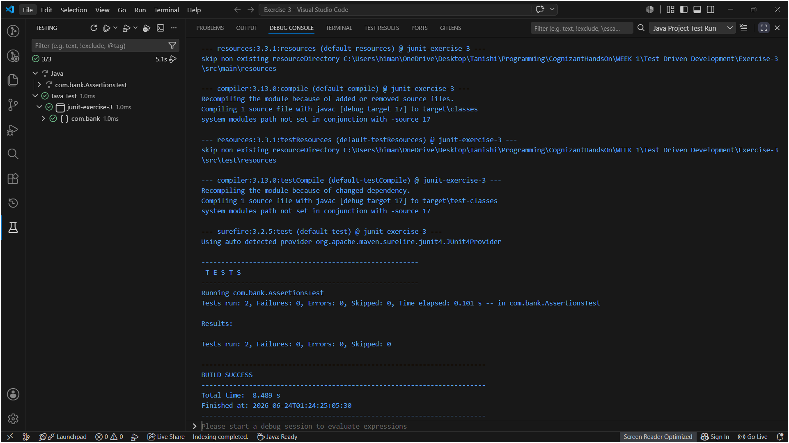

# Exercise 3: Assertions in JUnit

This one focuses on the actual assertion methods JUnit gives you to check test results — `assertEquals`, `assertTrue`, `assertFalse`, `assertNull`, `assertNotNull`. Exercise 1 was about getting the setup working, this one is about actually using it properly.

Using the same VS Code + Maven setup as Exercise 1 (Extension Pack for Java)

## Files in this Folder

- `pom.xml` – Maven project file with the JUnit 4.13.2 dependency.
- `src/main/java/com/bank/Account.java` – A small `Account` class so the assertions have something realistic to check, instead of just plain numbers.
- `src/test/java/com/bank/AssertionsTest.java` – Two test methods: one is the exact example from the exercise sheet, the other applies the same assertions to the `Account` class.

---

## AssertionsTest Class

### Objective

Write test methods that use the five core JUnit assertions and understand what each one is actually checking.

### Approach

I wrote two test methods:

**`testAssertions()`** — this is the example given in the exercise, using plain values:
- `assertEquals(5, 2 + 3)` — checks the two values are equal
- `assertTrue(5 > 3)` — checks a condition is true
- `assertFalse(5 < 3)` — checks a condition is false
- `assertNull(null)` — checks a value is null
- `assertNotNull(new Object())` — checks a value is not null

**`testAccountAssertions()`** — I added this second one on my own to see the same assertions used in a more realistic test, against an `Account` object instead of raw numbers:
- `assertEquals(15000.0, account.getBalance(), 0.0001)` — checking the balance is what was set
- `assertTrue(account.getBalance() > 10000)` — checking the balance is over a VIP threshold
- `assertFalse(account.isOverdrawn())` — checking the account isn't negative
- `assertNull(account.getNickname(null))` — checking a nickname that wasn't set is actually null
- `assertNotNull(account.getAccountHolder())` — checking the account holder's name exists

### A thing I had to look up: assertEquals with doubles

`assertEquals(15000.0, account.getBalance(), 0.0001)` has a third argument that isn't in the original example — that's a **delta** (tolerance), and it's required specifically for `double`/`float` comparisons in JUnit 4. Floating point numbers can have tiny rounding errors (like `0.1 + 0.2` not being exactly `0.3` in binary), so JUnit forces you to say "treat these as equal if they're within this small range" instead of checking for exact equality. For plain `int` comparisons like in `testAssertions()`, no delta is needed since integers don't have that rounding problem.

### Run

Click the **Testing icon** (flask shape) in the VS Code left sidebar → find `AssertionsTest` under the project → click the ▶ play button next to it (or run the whole project's tests from the top).

### Output



### Observation

Both test methods passed, with all 10 individual assertions (5 in each method) succeeding — shown as a green checkmark next to `testAssertions` and `testAccountAssertions` in the Testing panel.

---

## Folder Structure

```text
Test Driven Development/
└── Exercise-3/
    ├── pom.xml
    ├── README.md
    ├── src/
    │   ├── main/
    │   │   └── java/
    │   │       └── com/
    │   │           └── bank/
    │   │               └── Account.java
    │   └── test/
    │       └── java/
    │           └── com/
    │               └── bank/
    │                   └── AssertionsTest.java
    └── exercise3_test_run.png
```

---

## What I Learned

- A single `@Test` method can have multiple assertions in it — if any one of them fails, the whole test method is marked as failed and JUnit stops at that line (the rest of the assertions in that method don't run).
- `assertEquals` for `double`/`float` values needs a third "delta" argument because of floating-point precision — comparing decimals for *exact* equality is unreliable.
- `assertTrue` / `assertFalse` are for checking boolean conditions — basically anything that evaluates to `true` or `false`.
- `assertNull` / `assertNotNull` are specifically for checking whether an object reference is `null` or not — useful for catching cases where a method was supposed to return something but didn't.
- Writing a second test method against my own `Account` class (instead of just the plain-value example) made it click better — assertions are really just "did this method/object behave the way I expected", not just abstract math checks.
