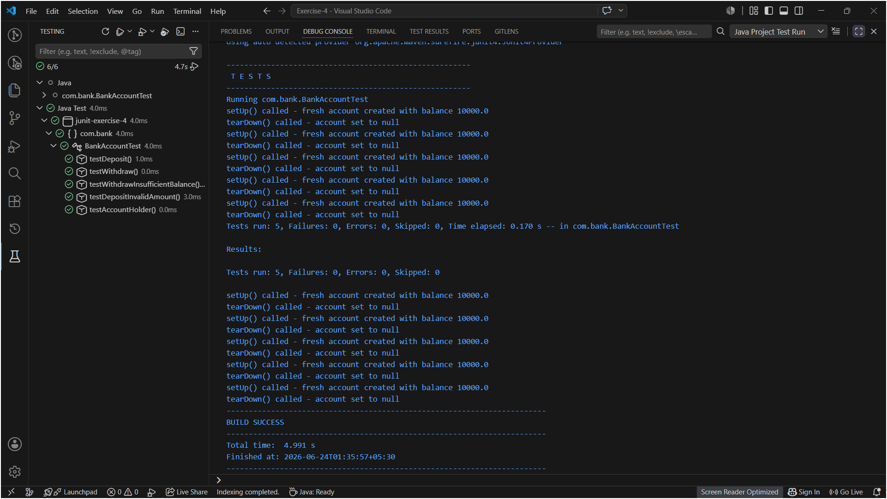

# Exercise 4: AAA Pattern, Test Fixtures, Setup and Teardown Methods

This exercise is about structuring tests properly using the **Arrange-Act-Assert (AAA)** pattern, and using `@Before` and `@After` to set up and clean up before/after each test. It builds on Exercise 1 (setup) and Exercise 3 (assertions), just with better organization now.

Same VS Code + Maven setup as the previous exercises.

## Files in this Folder

- `pom.xml` – Maven project file with the JUnit 4.13.2 dependency.
- `src/main/java/com/bank/BankAccount.java` – A `BankAccount` class with `deposit()`, `withdraw()`, and `getBalance()` methods. This is what the tests are actually testing.
- `src/test/java/com/bank/BankAccountTest.java` – The test class, with 5 test methods all written in the AAA pattern, plus `@Before` and `@After` methods.

---

## What is the AAA Pattern?

It's just a way of organizing each test method into three clear sections:

- **Arrange** – set up the inputs and expected output
- **Act** – call the actual method being tested
- **Assert** – check if the result matches what was expected

Before I learned this, I was writing tests where everything was mixed together in one block and it was hard to tell what was actually being checked. AAA makes each test easier to read and debug — if a test fails, I can immediately see what the input was (Arrange), what was called (Act), and what the expected result was (Assert).

---

## What is a Test Fixture?

A test fixture is any object or state that multiple tests share and need to start in the same condition. In `BankAccountTest.java`, the fixture is the `account` field — it's declared at the class level so all test methods can use it, but `@Before` makes sure it's freshly created before every single test.

This matters because if Test 1 deposits money into the account and modifies the balance, and there was no reset between tests, Test 2 would be starting with a wrong balance and could either accidentally pass or fail for the wrong reason.

---

## BankAccountTest Class

### Approach

Created a `BankAccount` starting with a balance of 10,000 in `setUp()`. Each test method then follows the AAA layout clearly:

| Test | What it checks |
|---|---|
| `testDeposit` | Balance increases correctly after a deposit |
| `testWithdraw` | Balance decreases correctly after a withdrawal |
| `testWithdrawInsufficientBalance` | Throws `IllegalArgumentException` when amount > balance |
| `testDepositInvalidAmount` | Throws `IllegalArgumentException` for negative deposit |
| `testAccountHolder` | Account holder name is stored and returned correctly |

### @Before and @After

```java
@Before
public void setUp() {
    account = new BankAccount("Tanishi Rai", 10000.0);
}

@After
public void tearDown() {
    account = null;
}
```

`@Before` runs before every `@Test` method — so each test always starts with a clean account at 10,000, no matter what the previous test did to it.

`@After` runs after every `@Test` method — here I just set `account = null` to free the reference. For things like open file handles or database connections, `@After` is where you'd close those properly so they don't leak between tests.

The execution order for each test looks like:
```
setUp() → testDeposit() → tearDown()
setUp() → testWithdraw() → tearDown()
setUp() → testWithdrawInsufficientBalance() → tearDown()
... and so on
```

### Run

Click the **Testing icon** (flask) in the VS Code left sidebar → find `BankAccountTest` → click ▶ to run all 5 tests.

You can also open `BankAccountTest.java` directly and click the "Run Test" links that appear above each `@Test` method to run them one by one.

### Output



### Observation

All 5 tests passed with green checkmarks. The `System.out.println` lines inside `setUp()` and `tearDown()` show up in the VS Code Output/Debug Console tab, which is a good way to confirm the lifecycle is actually running in the right order — each test method is sandwiched between a setUp and tearDown call.

---

## Folder Structure

```text
Test Driven Development/
└── Exercise-4/
    ├── pom.xml
    ├── README.md
    ├── src/
    │   ├── main/
    │   │   └── java/
    │   │       └── com/
    │   │           └── bank/
    │   │               └── BankAccount.java
    │   └── test/
    │       └── java/
    │           └── com/
    │               └── bank/
    │                   └── BankAccountTest.java
    └── exercise4_test_run.png
```

---

## What I Learned

- **AAA pattern** makes each test self-documenting — anyone reading `testDeposit()` can immediately see what was set up, what was called, and what was expected, without having to trace through the whole class.
- **`@Before`** is the right place to create the test fixture (shared object), not inside each individual test method — avoids copy-pasting `new BankAccount(...)` in every single test.
- **`@After`** is mainly useful for cleanup when tests involve real resources like files, network connections, or databases. For plain Java objects like here, the garbage collector handles it anyway, but setting to `null` is still good practice.
- **Order of execution**: `@Before` → `@Test` → `@After`, repeated fresh for every single test method. Each test is completely isolated because of this.
- For tests where an exception is the expected behaviour (like withdrawing more than the balance), there's no separate Act and Assert — they combine into one `assertThrows(...)` line, which is fine and actually cleaner than wrapping in try/catch manually.
