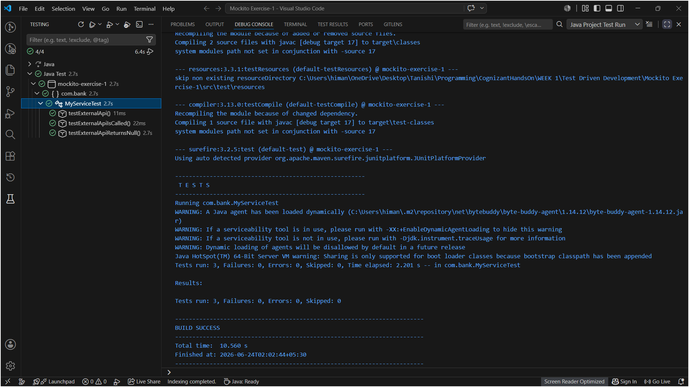
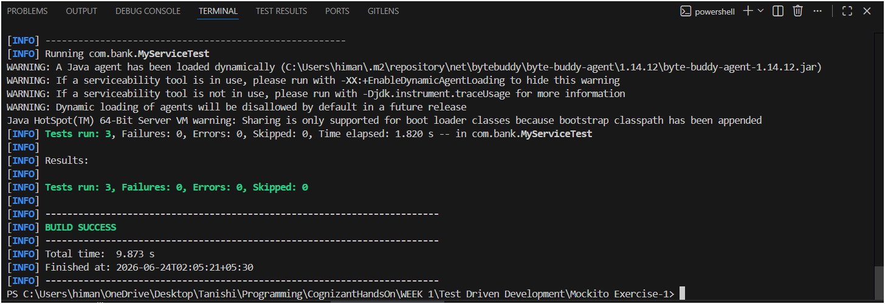

# Mockito Exercise 1: Mocking and Stubbing

This is the first Mockito exercise. Mockito is a separate library on top of JUnit that lets you create fake versions of objects (mocks) that your code depends on, so you can test your own code in isolation without needing the real external thing to be available.

Same VS Code + Maven setup as the JUnit exercises. The only difference is the `pom.xml` now has **three** dependencies instead of one.

---

## Files in this Folder

- `pom.xml` – Maven project file with JUnit 5 + Mockito dependencies.
- `src/main/java/com/bank/ExternalApi.java` – An interface representing the external API (the thing we're mocking).
- `src/main/java/com/bank/MyService.java` – The actual service being tested, which depends on `ExternalApi`.
- `src/test/java/com/bank/MyServiceTest.java` – Three test cases using Mockito to mock and stub `ExternalApi`.

---

## What is Mocking and Why

In real projects, a service like `MyService` usually depends on something external — a payment API, an SMS gateway, a database, some third-party data provider. Calling the real thing during tests is a bad idea because:
- It's slow (network calls)
- It costs money sometimes (API calls)
- It might not be available in a test environment
- It makes tests unpredictable (what if the API is down?)

Mockito solves this by letting you create a **mock** — a fake stand-in object that looks like the real `ExternalApi` but just returns whatever you tell it to return. You control its behavior completely.

**Stubbing** means telling the mock what to return when a specific method is called:
```java
when(mockApi.getData()).thenReturn("Mock Data");
```
This line says: "whenever `getData()` is called on this mock, return the string `Mock Data`."

---

## MyServiceTest Class

### Three tests written

**`testExternalApi()`** — the exact solution from the exercise sheet. Creates a mock, stubs `getData()` to return `"Mock Data"`, passes the mock into `MyService`, and checks the result.

**`testExternalApiIsCalled()`** — uses `verify()` to confirm that `MyService.fetchData()` actually called `externalApi.getData()` exactly once. This is useful when you want to confirm that your service isn't ignoring the API or calling it the wrong number of times.

**`testExternalApiReturnsNull()`** — stubs the mock to return `null` and checks that `fetchData()` passes that null back correctly. Good for testing edge cases where an API might return nothing.

### The three Mockito lines to remember

```java
ExternalApi mockApi = Mockito.mock(ExternalApi.class); // create the mock
when(mockApi.getData()).thenReturn("Mock Data");         // stub it
verify(mockApi, Mockito.times(1)).getData();             // verify it was called
```

---

## How to Run

### Step 1: Folder structure

Create these two folders first before placing any files (right-click root → New Folder, type the full path at once):
- `src/main/java/com/bank`
- `src/test/java/com/bank`

Place `ExternalApi.java` and `MyService.java` in `src/main/java/com/bank/`, and `MyServiceTest.java` in `src/test/java/com/bank/`. Keep `pom.xml` and `README.md` at the root.

### Step 2: Open in VS Code

File → Open Folder → select the `Mockito Exercise-1` folder. Wait for the status bar to show **"Java: Ready"** before doing anything else — this one downloads more jars than previous exercises (JUnit 5 + Mockito), so it takes a bit longer the first time.

### Step 3: Run via terminal

Open terminal (`Ctrl + ~`) and run:
```
mvn test
```

### Step 4: Run via Testing panel

Click the **Testing icon** (flask) in the left sidebar → find `MyServiceTest` → click ▶ to run all 3 tests.

---

## Output

### Testing Panel — all 3 tests passing



### Terminal — mvn test result



### Observation

All 3 tests passed. The terminal confirms `Tests run: 3, Failures: 0, Errors: 0, Skipped: 0` and `BUILD SUCCESS`, which also confirms Mockito was downloaded and wired up correctly through Maven. The Testing panel shows green checkmarks for `testExternalApi`, `testExternalApiIsCalled`, and `testExternalApiReturnsNull`.

---

## Folder Structure

```text
Test Driven Development/
└── Mockito Exercise-1/
    ├── pom.xml
    ├── README.md
    ├── src/
    │   ├── main/
    │   │   └── java/
    │   │       └── com/
    │   │           └── bank/
    │   │               ├── ExternalApi.java
    │   │               └── MyService.java
    │   └── test/
    │       └── java/
    │           └── com/
    │               └── bank/
    │                   └── MyServiceTest.java
    └── screenshots/
        ├── mockito_ex1_test_run.png
        └── mockito_ex1_terminal.png
```

---

## What I Learned

- Mockito is a separate library from JUnit — JUnit runs the tests, Mockito helps you fake the dependencies inside those tests. They work together but do different jobs.
- `Mockito.mock(SomeClass.class)` creates a fake object of that type. It won't actually do anything unless you stub it.
- `when(...).thenReturn(...)` is how you stub — "when this method is called, return this value." Without stubbing, Mockito returns `null` for objects, `0` for numbers, `false` for booleans by default.
- `verify(mock, times(n)).method()` checks that a method was called a specific number of times — useful for making sure the service is actually using the dependency, not just ignoring it.
- The reason `ExternalApi` is an **interface** (not a class) is that it makes mocking and dependency injection cleaner — you can swap the real implementation for a mock without changing `MyService` at all. This is a pattern called "program to an interface."
- This project uses **JUnit 5** (called JUnit Jupiter) instead of JUnit 4 like the previous exercises. The main difference you'll notice is that assertions come from `org.junit.jupiter.api.Assertions` instead of `org.junit.Assert`, and the `@Test` import is from `org.junit.jupiter.api.Test`. The exercise solution code already uses JUnit 5 style, so I matched that.