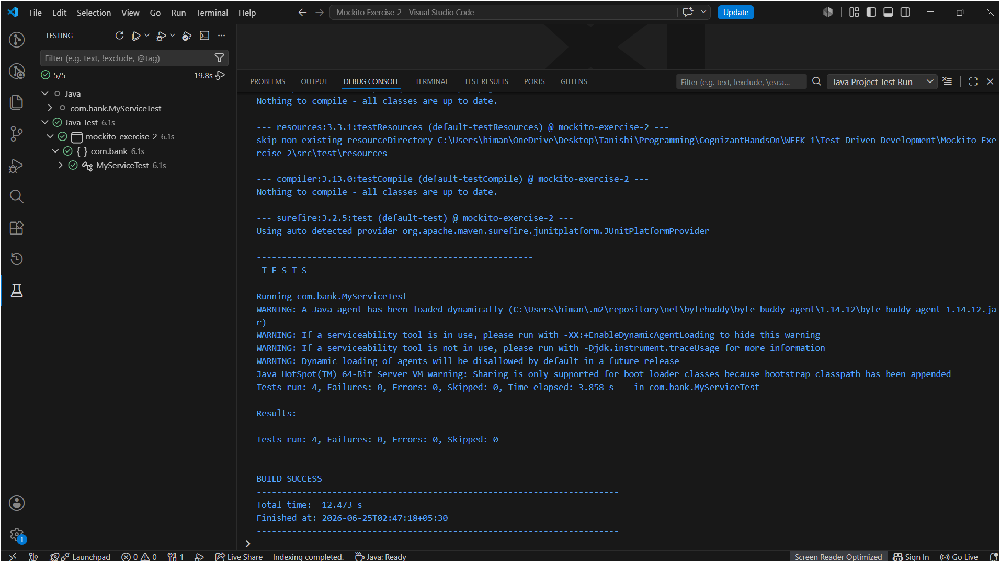
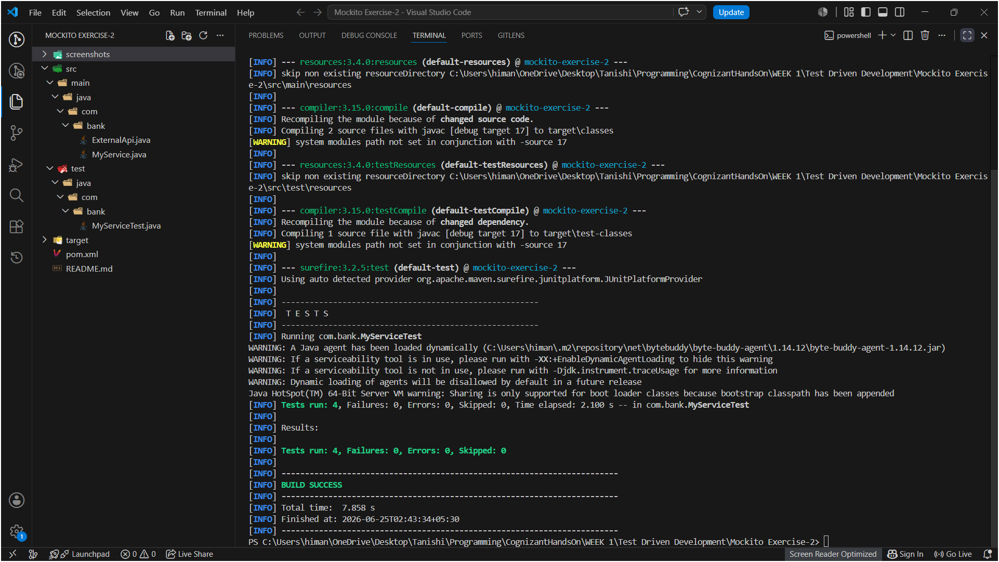

# Mockito Exercise 2: Verifying Interactions

This exercise is about using Mockito's `verify()` to check that methods were actually called on a mock — not just that the result was correct, but that the right interactions happened. It builds directly on Exercise 1 (mocking and stubbing).

Same VS Code + Maven setup with JUnit 5 + Mockito dependencies in `pom.xml`.

---

## Files in this Folder

- `pom.xml` – Maven project file with JUnit 5 + Mockito dependencies.
- `src/main/java/com/bank/ExternalApi.java` – Interface with two methods: `getData()` (no args) and `getDataById(int id)` (takes an argument), so we can demonstrate both basic and argument-specific verification.
- `src/main/java/com/bank/MyService.java` – Service that depends on `ExternalApi` through constructor injection.
- `src/test/java/com/bank/MyServiceTest.java` – Four test cases covering different `verify()` patterns.

---

## What is Interaction Verification

In Exercise 1, `verify()` was used once as a bonus extra. This exercise focuses on it properly. The difference between stubbing and verification:

- **Stubbing** (`when...thenReturn`) — controls what the mock *returns*
- **Verification** (`verify`) — checks that a method *was actually called*, with what arguments, and how many times

This matters because a test can pass on the assertion side but still have a bug — for example, if `MyService.fetchData()` just returned a hardcoded string instead of calling the API at all, an `assertEquals` wouldn't catch that. `verify()` would, because it checks the interaction actually happened.

---

## MyServiceTest Class

### Four tests written

**`testVerifyInteraction()`** — the exact solution from the exercise sheet. Calls `service.fetchData()` and then verifies that `mockApi.getData()` was called. No `when()` stub needed here since the return value isn't being checked, just the interaction.

**`testVerifyInteractionWithSpecificArgument()`** — verifies that `getDataById()` was called with the specific argument `101`, not just any argument. This is the core of this exercise — `verify(mockApi).getDataById(101)` only passes if the method was called with exactly `101`.

**`testVerifyCalledTwice()`** — calls `fetchData()` twice and uses `verify(mockApi, times(2)).getData()` to confirm it was called exactly 2 times. `times(n)` lets you assert the exact call count.

**`testVerifyNeverCalled()`** — calls only `fetchData()` and then uses `verify(mockApi, never()).getDataById(anyInt())` to confirm that `getDataById()` was never called at all. `anyInt()` is a Mockito argument matcher meaning "any integer value".

### verify() variations to remember

```java
verify(mockApi).getData();                        // called exactly once (default)
verify(mockApi).getDataById(101);                 // called with specific argument 101
verify(mockApi, times(2)).getData();              // called exactly 2 times
verify(mockApi, never()).getDataById(anyInt());   // never called with any int argument
```

---

## How to Run

### Step 1: Folder structure

Create both folders first (right-click root → New Folder, type full path):
- `src/main/java/com/bank`
- `src/test/java/com/bank`

Place `ExternalApi.java` and `MyService.java` in `src/main/java/com/bank/`, `MyServiceTest.java` in `src/test/java/com/bank/`, and `pom.xml` + `README.md` at root.

### Step 2: Open in VS Code

File → Open Folder → select `Mockito Exercise-2`. Wait for **"Java: Ready"** in the status bar.

### Step 3: Run via terminal

Open terminal (`Ctrl + ~`) and run:
```
mvn test
```
Expected output at the end:
```
Tests run: 4, Failures: 0, Errors: 0, Skipped: 0
BUILD SUCCESS
```

### Step 4: Run via Testing panel

Click the **Testing icon** (flask) in left sidebar → find `MyServiceTest` → click ▶ to run all 4 tests.

---

## Output

### Testing Panel — all 4 tests passing



### Terminal — mvn test result



### Observation

All 4 tests passed. Each `verify()` pattern behaved correctly — the basic interaction check, the argument-specific check, the call-count check, and the never-called check. `verify()` throws a `WantedButNotInvoked` exception if the expected interaction didn't happen, which is what causes a test to fail when the service isn't calling the API correctly.

---

## Folder Structure

```text
Test Driven Development/
└── Mockito Exercise-2/
    ├── pom.xml
    ├── README.md
    ├── src/
    │   ├── main/
    │   │   └── java/
    │   │       └── com/
    │   │           └── bank/
    │   │               ├── ExternalApi.java
    │   │               └── MyService.java
    │   └── test/
    │       └── java/
    │           └── com/
    │               └── bank/
    │                   └── MyServiceTest.java
    └── screenshots/
        ├── mockito_ex2_test_run.png
        └── mockito_ex2_terminal.png
```

---

## What I Learned

- `verify()` checks *behaviour* not just *output* — it confirms a method was actually called, which assertions on return values can't catch.
- `verify(mock).method(specificValue)` is stricter than `verify(mock).method(anyValue)` — it fails if the method was called with a different argument. This is important when the argument passed to the API actually matters (like passing the right customer ID).
- `times(n)` lets you assert exact call count — useful for catching bugs where a service calls an API in a loop and might be calling it too many or too few times.
- `never()` is the opposite of `times(1)` — checks the method was not called at all. Good for negative testing ("make sure this path doesn't trigger an API call it shouldn't").
- `anyInt()` (and `anyString()`, `any()` etc.) are **argument matchers** — they match any value of that type instead of a specific one. Used in `never()` here because I didn't care which ID was passed, just that no ID was passed at all.
- You don't need `when().thenReturn()` before `verify()` — stubbing controls the return value, verification checks the call. They're independent. If you only care about whether the method was called, you can skip stubbing entirely.
