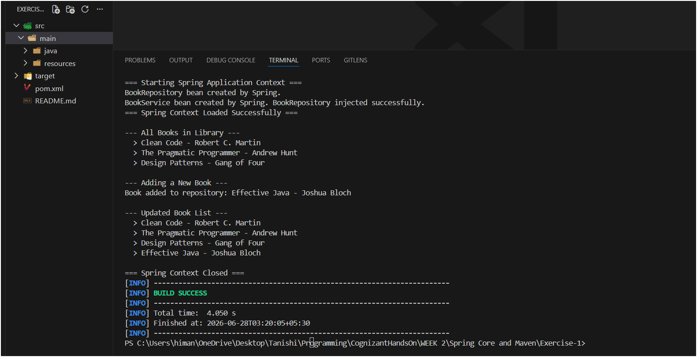

# Spring Core Exercise 1: Configuring a Basic Spring Application

This is the first Spring exercise. The goal is to set up a Spring project from scratch using XML-based configuration, define beans for `BookService` and `BookRepository`, and let Spring wire them together using Dependency Injection. No Spring Boot here — this is raw Spring Core so the wiring is visible and explicit.

Same VS Code + Maven setup as previous exercises.

---

## Files in this Folder

- `pom.xml` – Maven project file with Spring Core and Spring Context dependencies.
- `src/main/resources/applicationContext.xml` – Spring XML configuration file that defines the two beans and wires them together.
- `src/main/java/com/library/repository/BookRepository.java` – Data access class (simulates a book database with an in-memory list).
- `src/main/java/com/library/service/BookService.java` – Business logic class, depends on `BookRepository`.
- `src/main/java/com/library/main/LibraryManagementApplication.java` – Main class that loads the Spring context and tests the setup.

---

## What Spring is Doing Here

Without Spring, if `BookService` needs a `BookRepository`, you'd write:
```java
BookRepository repo = new BookRepository();
BookService service = new BookService(repo);
```
You're manually creating and wiring objects.

With Spring, you declare both classes as **beans** in `applicationContext.xml` and tell Spring that `BookService` needs a `BookRepository`. Spring then:
1. Reads the XML on startup
2. Creates `BookRepository` first (no dependencies)
3. Creates `BookService`, passing in the already-created `BookRepository`
4. Manages both objects for the lifetime of the application

This is **Dependency Injection (DI)** — `BookService` never calls `new BookRepository()` itself. Spring handles that and "injects" it in. The benefit is that classes are loosely coupled — `BookService` doesn't care how `BookRepository` is created, configured, or even which version it gets.

---

## applicationContext.xml

This is the heart of this exercise. It lives in `src/main/resources/` so Maven puts it on the classpath automatically.

```xml
<bean id="bookRepository" class="com.library.repository.BookRepository" />

<bean id="bookService" class="com.library.service.BookService">
    <constructor-arg ref="bookRepository" />
</bean>
```

- `id` — the name used to look the bean up from the context (`context.getBean("bookService")`)
- `class` — fully qualified class name Spring uses to instantiate the object
- `constructor-arg ref="bookRepository"` — tells Spring to pass the `bookRepository` bean into `BookService`'s constructor

---

## Package Structure

The exercise specifically asks for separate packages for service and repository classes:

| Package | Class | Role |
|---------|-------|------|
| `com.library.repository` | `BookRepository` | Data access — stores and retrieves books |
| `com.library.service` | `BookService` | Business logic — calls repository, exposes operations |
| `com.library.main` | `LibraryManagementApplication` | Entry point — loads Spring context, tests wiring |

---

## How to Run

### Step 1: Folder structure

Create these folders first (right-click root → New Folder, type full path at once):
- `src/main/java/com/library/repository`
- `src/main/java/com/library/service`
- `src/main/java/com/library/main`
- `src/main/resources`

Place files:
- `BookRepository.java` → `src/main/java/com/library/repository/`
- `BookService.java` → `src/main/java/com/library/service/`
- `LibraryManagementApplication.java` → `src/main/java/com/library/main/`
- `applicationContext.xml` → `src/main/resources/`
- `pom.xml` + `README.md` → root level

### Step 2: Open in VS Code

File → Open Folder → select `Exercise-1`. Wait for **"Java: Ready"** in the status bar — Spring jars are larger than JUnit/Mockito so the first download takes a bit longer.

### Step 3: Run via terminal

Open terminal (`Ctrl + ~`) and run:
```
mvn compile exec:java
```
(No `-D` argument needed — `mainClass` is already configured in `pom.xml`.)

For PowerShell, if that doesn't work:
```
mvn compile exec:java '-Dexec.mainClass=com.library.main.LibraryManagementApplication'
```

### Step 4: What to expect in the output

Spring prints its own startup logs first (a few INFO lines), then your `System.out.println` lines appear:

```
=== Starting Spring Application Context ===
BookRepository bean created by Spring.
BookService bean created by Spring. BookRepository injected successfully.
=== Spring Context Loaded Successfully ===

--- All Books in Library ---
  > Clean Code - Robert C. Martin
  > The Pragmatic Programmer - Andrew Hunt
  > Design Patterns - Gang of Four

--- Adding a New Book ---
Book added to repository: Effective Java - Joshua Bloch

--- Updated Book List ---
  > Clean Code - Robert C. Martin
  > The Pragmatic Programmer - Andrew Hunt
  > Design Patterns - Gang of Four
  > Effective Java - Joshua Bloch

=== Spring Context Closed ===
```

The key lines to point out are:
- `BookRepository bean created by Spring.` — Spring instantiated it
- `BookService bean created by Spring. BookRepository injected successfully.` — Spring injected the dependency
- The book list growing after `addBook()` confirms the service → repository chain is working

---

## Output

### Terminal output



### Observation

Spring loaded `applicationContext.xml`, created both beans in the correct order (repository first, then service since service depends on repository), and injected `BookRepository` into `BookService` via constructor injection. All three operations — listing books, adding a book, and verifying the updated list — worked correctly through the service → repository chain.

---

## Folder Structure

```text
WEEK 2/
└── Spring Core and Maven/
    └── Exercise-1/
        ├── pom.xml
        ├── README.md
        ├── src/
        │   └── main/
        │       ├── java/
        │       │   └── com/
        │       │       └── library/
        │       │           ├── repository/
        │       │           │   └── BookRepository.java
        │       │           ├── service/
        │       │           │   └── BookService.java
        │       │           └── main/
        │       │               └── LibraryManagementApplication.java
        │       └── resources/
        │           └── applicationContext.xml
        └── spring_ex1_terminal.png
```

---

## What I Learned

- Spring's `ApplicationContext` is the container that manages all beans — it reads the XML, creates objects, injects dependencies, and holds everything for the app's lifetime.
- `ClassPathXmlApplicationContext("applicationContext.xml")` looks for the XML file on the classpath — which is why `applicationContext.xml` goes in `src/main/resources/` (Maven puts that folder on the classpath during build).
- In XML-based config, `<constructor-arg ref="beanId"/>` is how you tell Spring to inject one bean into another via the constructor. There's also `<property name="..." ref="..."/>` for setter injection, but constructor injection is generally preferred since it makes dependencies explicit.
- Spring creates beans in dependency order automatically — it knows `BookService` needs `BookRepository` (because of `constructor-arg`), so it creates `BookRepository` first even if you listed `BookService` first in the XML.
- `context.getBean("bookService")` retrieves a bean by the `id` you gave it in the XML. The return type is `Object` so it needs a cast, which is why `(BookService)` is there.
- Calling `context.close()` at the end is important — it properly destroys beans and releases resources. In a real app Spring Boot handles this lifecycle automatically, but here it's manual.
- The `spring-context` dependency automatically pulls in `spring-core`, `spring-beans`, `spring-aop` and other Spring modules it depends on — Maven handles those transitive dependencies so you don't have to list every Spring jar manually.
