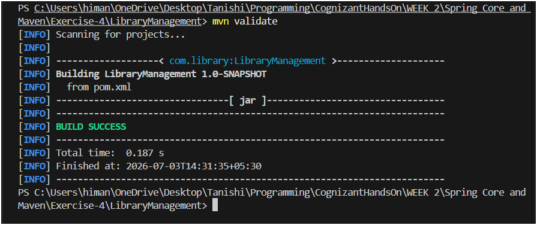

# Exercise 4 - Creating and Configuring a Maven Project

## What this does

Sets up a Maven project named `LibraryManagement` with the three Spring dependencies needed for the library application — Context, AOP, and WebMVC — and configures the compiler for Java 1.8.

---

## Project Structure

```
Exercise-4/
└── LibraryManagement/
    └── pom.xml
```

No Java source files in this exercise — the task is only about Maven project setup and dependency configuration.

---

## Dependencies added

| Dependency | Purpose |
|---|---|
| spring-context | Core Spring IoC container and DI |
| spring-aop | Aspect-Oriented Programming support |
| spring-webmvc | MVC framework for web layer |

All three use version `5.3.23`.

---

## How to verify the setup

```bash
cd Exercise-4/LibraryManagement
mvn dependency:resolve
```

This downloads all declared dependencies and confirms Maven can find them.

To also verify the compiler plugin is picked up:

```bash
mvn validate
```

---

## Expected Output

```
[INFO] --- dependency:3.x.x:resolve (default-cli) @ LibraryManagement ---
[INFO] The following files have been resolved:
[INFO]    org.springframework:spring-context:jar:5.3.23:compile
[INFO]    org.springframework:spring-aop:jar:5.3.23:compile
[INFO]    org.springframework:spring-webmvc:jar:5.3.23:compile
...
[INFO] BUILD SUCCESS
```

---

## Output Screenshot



