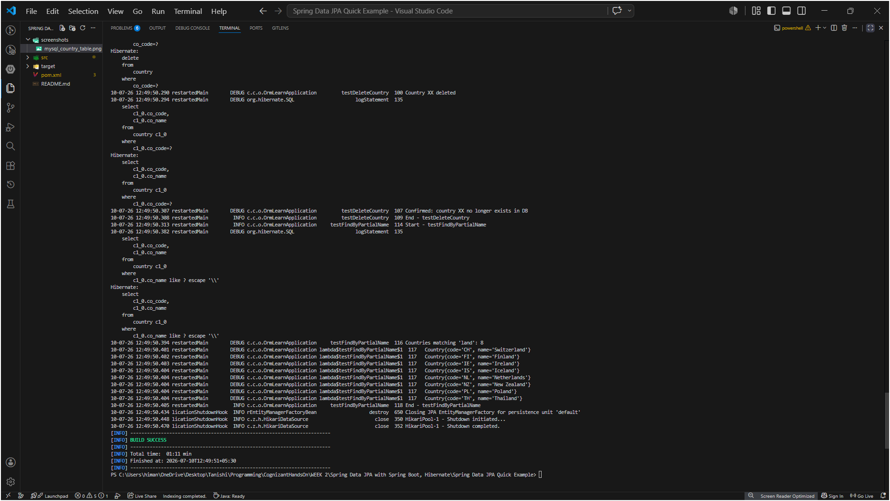
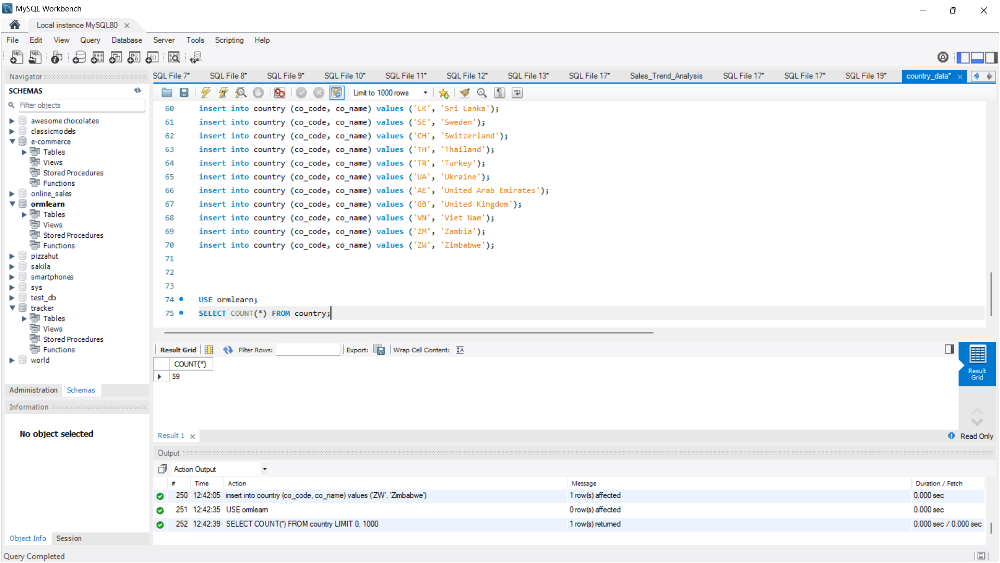

# Spring Data JPA — Quick Example (ORM Learn)

This is a Spring Boot + Spring Data JPA + Hibernate + MySQL project that demonstrates how to perform all basic database operations (CRUD) on a `country` table without writing a single line of SQL in the Java code. Spring Data JPA and Hibernate handle all of that under the hood.

---

## What This Project Covers

| Hands-on | What it does |
|---|---|
| 1 | Get all countries from DB |
| 5 | Find countries by partial name match |
| 6 | Find a specific country by country code, throw exception if not found |
| 7 | Add a new country |
| 8 | Update a country's name |
| 9 | Delete a country |

---

## Files in this Folder

```
Spring Data JPA Quick Example/
├── pom.xml
├── src/main/resources/
│   ├── application.properties        ← DB config, Hibernate settings, log levels
│   └── country_data.sql              ← Run this in MySQL Workbench first
├── src/main/java/com/cognizant/ormlearn/
│   ├── OrmLearnApplication.java      ← Main class, all test methods here
│   ├── model/Country.java            ← @Entity class mapped to country table
│   ├── repository/CountryRepository  ← extends JpaRepository, zero boilerplate
│   ├── service/CountryService.java   ← all CRUD service methods with @Transactional
│   └── service/exception/
│       └── CountryNotFoundException  ← thrown when a country code doesn't exist
└── screenshots/
```

---

## Pre-requisites

Before running this project, you need:
- **MySQL Server 8.0** installed and running
- **MySQL Workbench 8** (to run the SQL script)
- **Java 17+** and **Maven** installed

---

## How to Run — Step by Step

### Step 1: Set up MySQL database

Open **MySQL Workbench**, connect to your local MySQL server, and run the entire `country_data.sql` file:

File → Open SQL Script → select `src/main/resources/country_data.sql` → click the ⚡ (Execute All) button.

This will:
- Create the `ormlearn` schema
- Create the `country` table with `co_code` (PK) and `co_name` columns
- Insert all country records

### Step 2: Update your DB password in application.properties

Open `src/main/resources/application.properties` and update:
```
spring.datasource.username=root
spring.datasource.password=root     ← change this to your actual MySQL root password
```

### Step 3: Open the project in VS Code

File → Open Folder → select `Spring Data JPA Quick Example`. Wait for **"Java: Ready"** — this one downloads Spring Boot, Hibernate, and MySQL connector jars so it takes a bit longer the first time.

### Step 4: Run the application

Open terminal (`Ctrl + ~`) and run:
```
mvn spring-boot:run
```

Or open `OrmLearnApplication.java` and click the **▶ Run** link above the `main` method.

### Step 5: What to look for in the logs

Spring Boot prints a lot of startup logs. Look for these key lines between the noise:

```
INFO  Inside main
INFO  Start - testGetAllCountries
DEBUG Total countries fetched: 150+
...
DEBUG Country found: Country{code='IN', name='India'}
...
DEBUG Country added: Country{code='XX', name='TestLand'}
DEBUG Verified in DB: Country{code='XX', name='TestLand'}
...
DEBUG Updated country: Country{code='XX', name='TestLand Updated'}
...
DEBUG Confirmed: country XX no longer exists in DB
...
DEBUG Countries matching 'land': ...
```

You'll also see the actual SQL Hibernate is running:
```sql
select c1_0.co_code, c1_0.co_name from country c1_0
```
This is printed because `logging.level.org.hibernate.SQL=trace` is set in `application.properties`.

---

## Key Concepts Demonstrated

### @Entity and @Table
```java
@Entity
@Table(name = "country")
public class Country { ... }
```
Tells Hibernate this class maps to the `country` table. Every field annotated with `@Column` maps to a column.

### JpaRepository
```java
public interface CountryRepository extends JpaRepository<Country, String> { }
```
By extending `JpaRepository`, we get `findAll()`, `findById()`, `save()`, `deleteById()` and more — completely free, no implementation needed.

### Query Methods (derived from method name)
```java
List<Country> findByNameContaining(String keyword);
```
Spring Data JPA reads this method name and generates `SELECT * FROM country WHERE co_name LIKE '%keyword%'` automatically.

### @Transactional
Every service method is annotated `@Transactional`. This means Spring opens a Hibernate session, starts a transaction, runs the method, then commits and closes — all automatically. Without `@Transactional`, the Hibernate session would expire before the data could be read.

### ddl-auto = validate
```
spring.jpa.hibernate.ddl-auto=validate
```
On startup, Hibernate checks if the `country` table and its columns match the `@Entity` class. If the table doesn't exist or columns are missing, it throws an exception and the app won't start. This is why running `country_data.sql` first is required.

---

## Output

### Application startup and test methods output



### MySQL Workbench — country table after running SQL script



### Observation

All 6 test methods ran successfully — `getAllCountries` fetched 150+ records, `findCountryByCode("IN")` returned India, the add/update/delete cycle on country code "XX" worked correctly, and `findByPartialName("land")` returned countries like Finland, Iceland, Ireland etc. Hibernate's generated SQL was visible in the logs confirming every operation was translated to the correct SQL query.

---

## What I Learned

- Spring Data JPA sits on top of Hibernate — Hibernate does the actual ORM work (converting Java objects to SQL), Spring Data JPA just removes the boilerplate code (opening sessions, managing transactions etc.)
- `JpaRepository` gives you full CRUD without writing a single method body — it generates SQL at runtime based on the entity class and primary key type.
- `@Transactional` is critical for database operations in Spring — without it you'll get `LazyInitializationException` or transaction errors.
- Query methods (like `findByNameContaining`) are a Spring Data JPA feature where SQL is derived purely from the method name using naming conventions. Very convenient for simple queries.
- `ddl-auto=validate` is the safest setting for anything not in local dev — it checks schema matches entities but doesn't modify the DB. `ddl-auto=create` would drop and recreate tables every time, which would delete all data.
- The `application.properties` file is where you configure everything — DB connection, Hibernate behavior, and log levels. `logging.level.org.hibernate.SQL=trace` is extremely useful for debugging because it shows the exact SQL being run.
