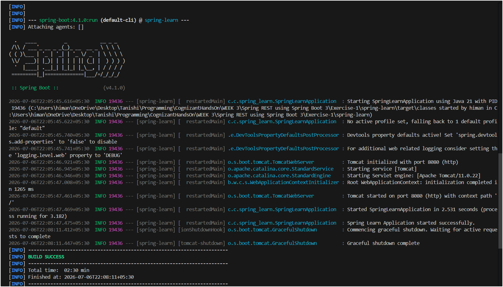

# Exercise 1 - Create a Spring Web Project using Maven

## Steps followed

### 1. Generated project from Spring Initializr

- Went to https://start.spring.io/
- Group: `com.cognizant`
- Artifact: `spring-learn`
- Dependencies added: **Spring Boot DevTools**, **Spring Web**
- Downloaded and extracted the zip to Eclipse workspace

---

### 2. Built the project

Ran the following command inside the extracted folder:

```bash
mvn clean package -Dhttp.proxyHost=proxy.cognizant.com -Dhttp.proxyPort=6050 -Dhttps.proxyHost=proxy.cognizant.com -Dhttps.proxyPort=6050 -Dhttp.proxyUser=123456
```

---

### 3. Imported into Eclipse

`File > Import > Maven > Existing Maven Projects > Browse > select extracted folder > Finish`

---

### 4. Added log to verify main() method (Step 9)

Added a logger inside `SpringLearnApplication.java` to confirm the main method runs:

```java
private static final Logger logger = LoggerFactory.getLogger(SpringLearnApplication.class);

public static void main(String[] args) {
    SpringApplication.run(SpringLearnApplication.class, args);
    logger.info("Spring Learn Application started successfully.");
}
```

---

### 5. Ran the application

Right-click `SpringLearnApplication.java` > `Run As` > `Spring Boot App`

---

## Expected Output in Console

```
  .   ____          _            __ _ _
 /\\ / ___'_ __ _ _(_)_ __  __ _ \ \ \ \
( ( )\___ | '_ | '_| | '_ \/ _` | \ \ \ \
 \\/  ___)| |_)| | | | | || (_| |  ) ) ) )
  '  |____| .__|_| |_|_| |_\__, | / / / /
 =========|_|==============|___/=/_/_/_/
 :: Spring Boot ::               (v3.x.x)

INFO  com.cognizant.springlearn.SpringLearnApplication - Starting SpringLearnApplication
INFO  com.cognizant.springlearn.SpringLearnApplication - Started SpringLearnApplication
INFO  com.cognizant.springlearn.SpringLearnApplication - Spring Learn Application started successfully.
```

---

## Output Screenshot




---

## SME Walkthrough Notes

| Item | Description |
|---|---|
| `src/main/java` | All application source code lives here |
| `src/main/resources` | `application.properties` and other config files |
| `src/test/java` | Test classes go here |
| `SpringLearnApplication.java` | Entry point — `main()` bootstraps the Spring context via `SpringApplication.run()` |
| `@SpringBootApplication` | Combines `@Configuration`, `@EnableAutoConfiguration`, and `@ComponentScan` — sets up the entire Spring context automatically |
| `pom.xml` | Defines project metadata, Spring Boot parent, dependencies (spring-boot-starter-web, devtools), and build plugins |
| Dependency Hierarchy | Open in Eclipse: right-click `pom.xml` > `Open With` > `Maven POM Editor` > click `Dependency Hierarchy` tab to see the full tree |
