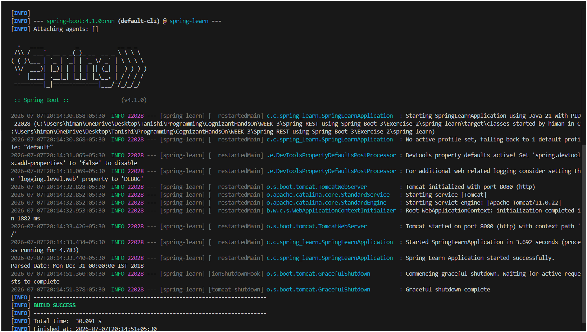

# Exercise 2 - Load SimpleDateFormat from Spring Configuration XML

## What this does

Instead of creating `SimpleDateFormat` in multiple places in the code, a single bean is defined in `date-format.xml`. Spring creates and manages it. The application just calls `getBean()` to get it and uses it to parse a date string.

---


## Expected Output

```
INFO  c.c.spring_learn.SpringLearnApplication : Spring Learn Application started successfully.
Parsed Date: Mon Dec 31 00:00:00 IST 2018
```

---

## Output Screenshot



