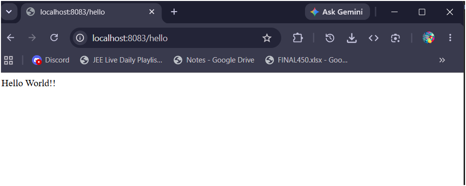
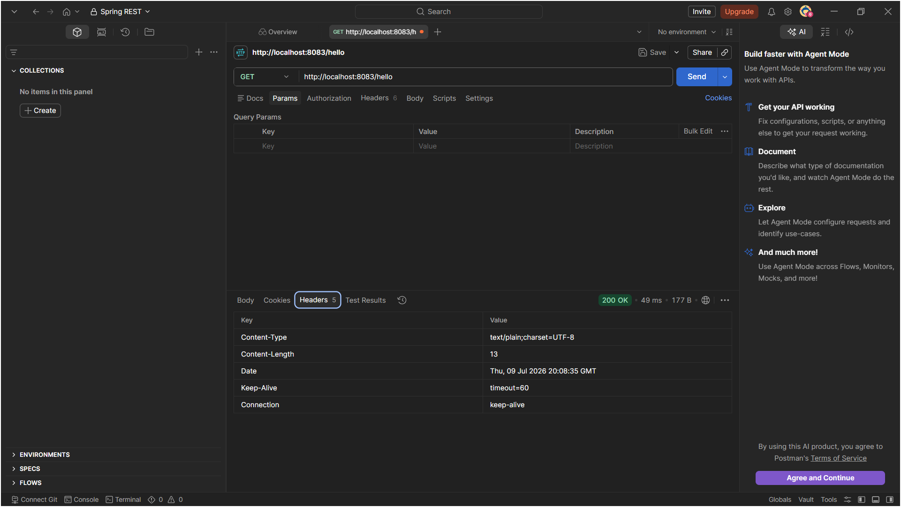

# Exercise 3 - Hello World RESTful Web Service

## What this does

A simple GET REST endpoint `/hello` that returns `Hello World!!` as a plain text response. Built using Spring Web's `@RestController`.

---

## Files added/changed in spring-learn project

| File | Location in project | What was done |
|---|---|---|
| `HelloController.java` | `src/main/java/com/cognizant/spring_learn/controller/` | New file — REST controller with GET /hello |
| `SpringLearnApplication.java` | `src/main/java/com/cognizant/spring_learn/` | Cleaned up — removed displayDate() from Exercise-2 |
| `application.properties` | `src/main/resources/` | Added `server.port=8083` |

---

## Endpoint details

| | |
|---|---|
| Method | GET |
| URL | http://localhost:8083/hello |
| Response | `Hello World!!` |

---

## Expected console output when /hello is hit

```
INFO  c.c.spring_learn.controller.HelloController : Start sayHello
INFO  c.c.spring_learn.controller.HelloController : End sayHello
```

---

## Output Screenshot

### Browser


### Postman


> Save both screenshots in this folder after running.
