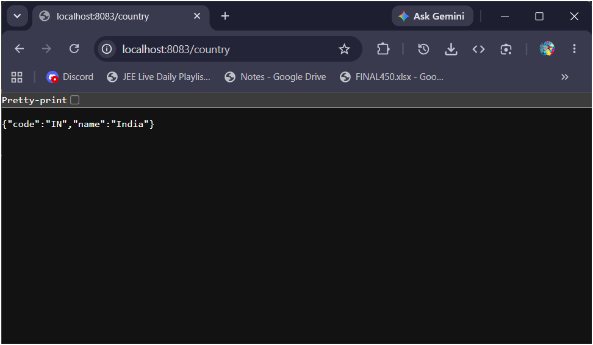
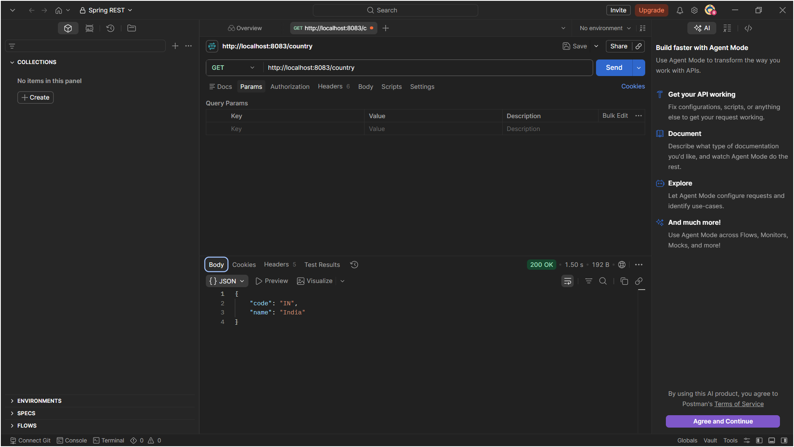
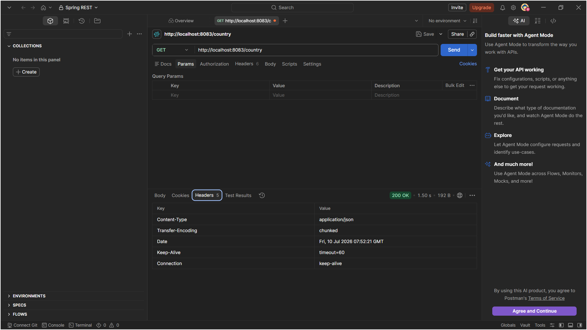
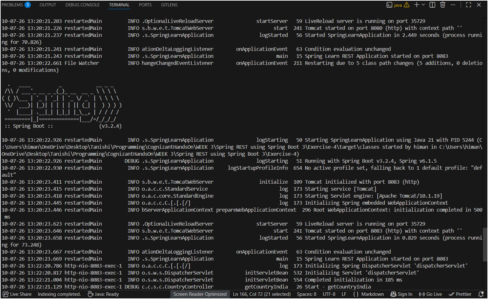

# Spring REST Exercise 4: Country Web Service

This exercise creates a REST web service that returns India's country details as a JSON response. The country data is loaded from a Spring XML configuration file and returned by a REST controller. Spring Boot's Jackson library handles the conversion from Java object to JSON automatically.

---

## Files in this Folder

```
Exercise-4/
├── pom.xml
├── src/main/resources/
│   ├── application.properties       ← sets server port to 8083
│   └── country.xml                  ← Spring XML bean config for India
├── src/main/java/com/cognizant/springlearn/
│   ├── SpringLearnApplication.java  ← main class
│   ├── Country.java                 ← model class (POJO)
│   └── controller/
│       └── CountryController.java   ← REST controller with getCountryIndia()
└── screenshots/
```

---

## What Happens When a Request Hits /country

This is the internal flow from the moment a browser or Postman sends `GET http://localhost:8083/country`:

```
Client (Browser/Postman)
        |
        | HTTP GET /country
        ▼
Embedded Tomcat (Spring Boot)
        |
        | Routes to @RequestMapping("/country")
        ▼
CountryController.getCountryIndia()
        |
        | Loads country.xml from classpath
        | Gets "india" bean → Country{code="IN", name="India"}
        ▼
Jackson ObjectMapper (auto-configured by Spring Boot)
        |
        | Calls getCode() → "IN"
        | Calls getName() → "India"
        | Builds JSON: { "code": "IN", "name": "India" }
        ▼
HTTP Response
        | Body:    { "code": "IN", "name": "India" }
        | Status:  200 OK
        | Content-Type: application/json
        ▼
Client receives JSON
```

### What @RestController does
`@RestController` is a combination of `@Controller` + `@ResponseBody`.
- `@Controller` — marks the class as a Spring MVC controller that handles HTTP requests
- `@ResponseBody` — tells Spring not to look for a view/template to render, but instead to write the return value directly into the HTTP response body

Without `@ResponseBody`, Spring would try to find a view named "Country" and fail. With it, the return value goes straight to the response as JSON.

### How the Country object becomes JSON
Spring Boot automatically includes **Jackson** (a JSON library) when `spring-boot-starter-web` is in `pom.xml`. When `getCountryIndia()` returns a `Country` object, Jackson:
1. Looks at all public getter methods on the class
2. `getCode()` → field name `"code"`, value `"IN"`
3. `getName()` → field name `"name"`, value `"India"`
4. Produces: `{ "code": "IN", "name": "India" }`
5. Sets `Content-Type: application/json` header automatically

No extra configuration needed — this is all handled by Spring Boot's auto-configuration.

### What @RequestMapping does
`@RequestMapping("/country")` maps any HTTP request to the path `/country` to this method. By default it accepts all HTTP methods (GET, POST etc.). To restrict to GET only, you'd use `@GetMapping("/country")` — but the exercise specifies `@RequestMapping` so we use that.

---

## How to Run

### Step 1: Folder structure

Create folders before placing files:
- `src/main/java/com/cognizant/springlearn/controller`
- `src/main/java/com/cognizant/springlearn`
- `src/main/resources`

Place files:
- `Country.java` → `src/main/java/com/cognizant/springlearn/`
- `SpringLearnApplication.java` → `src/main/java/com/cognizant/springlearn/`
- `CountryController.java` → `src/main/java/com/cognizant/springlearn/controller/`
- `country.xml` + `application.properties` → `src/main/resources/`
- `pom.xml` → root

### Step 2: Open in VS Code

File → Open Folder → select `Exercise-4`. Wait for **"Java: Ready"** in the status bar.

### Step 3: Run

Open terminal (`Ctrl + ~`) and run:
```
mvn spring-boot:run
```

Look for this line in the logs to confirm it started successfully:
```
Tomcat started on port 8083 (http) with context path '/'
```

### Step 4: Test the endpoint

**Option A — Browser:**
Open any browser and go to:
```
http://localhost:8083/country
```
You should see:
```json
{
  "code": "IN",
  "name": "India"
}
```

**Option B — Postman (recommended, shows headers):**
1. Open Postman
2. Set method to **GET**
3. Enter URL: `http://localhost:8083/country`
4. Click **Send**
5. Response body shows the JSON
6. Click the **Headers** tab in the response section to see HTTP headers

**Option C — Browser Developer Tools:**
1. Open browser → go to `http://localhost:8083/country`
2. Press `F12` → click **Network** tab
3. Refresh the page
4. Click on the `country` request in the list
5. Click **Headers** tab to see request and response headers

---

## HTTP Headers to Check in Postman / Dev Tools

When you look at the response headers, you should see:

| Header | Value | What it means |
|--------|-------|---------------|
| `Content-Type` | `application/json` | Response body is JSON |
| `Content-Length` | (number) | Size of response in bytes |
| `Transfer-Encoding` | `chunked` | How data is sent |
| `Date` | (timestamp) | When response was generated |

The `Content-Type: application/json` header is the important one — Jackson sets this automatically when it serializes the Country object to JSON.

---

## Output

### Browser response — JSON output



### Postman — Response Body tab



### Postman — Headers tab



### Terminal — Spring Boot startup log



---

## Folder Structure

```text
WEEK 3/
└── Spring REST using Spring Boot 3/
    └── Exercise-4/
        ├── pom.xml
        ├── README.md
        ├── src/
        │   └── main/
        │       ├── java/com/cognizant/springlearn/
        │       │   ├── SpringLearnApplication.java
        │       │   ├── Country.java
        │       │   └── controller/
        │       │       └── CountryController.java
        │       └── resources/
        │           ├── application.properties
        │           └── country.xml
        └── screenshots/
            ├── rest_ex4_browser.png
            ├── rest_ex4_postman_body.png
            ├── rest_ex4_postman_headers.png
            └── rest_ex4_terminal.png
```

---

## What I Learned

- `@RestController` is a shortcut for `@Controller + @ResponseBody`. It tells Spring that every method's return value should be written directly into the HTTP response body, not treated as a view name.
- Spring Boot auto-configures Jackson as the default JSON converter when `spring-boot-starter-web` is included. Any object returned from a `@RestController` method is automatically converted to JSON — no extra config needed.
- Jackson uses getter method names to determine JSON field names: `getCode()` becomes `"code"`, `getName()` becomes `"name"`. This is why having proper getters in the model class matters.
- `@RequestMapping("/country")` registers the URL pattern. Any request to `/country` routes to `getCountryIndia()`.
- The `Content-Type: application/json` header in the response is set automatically by Jackson/Spring — you don't set it manually. It tells the client that the response body is JSON.
- `country.xml` goes in `src/main/resources/` so Maven puts it on the classpath. `ClassPathXmlApplicationContext("country.xml")` then finds it at runtime without needing a full path.
- `server.port=8083` in `application.properties` overrides Spring Boot's default port (8080). Without this line, the app would run on 8080 and the exercise URL wouldn't work.
