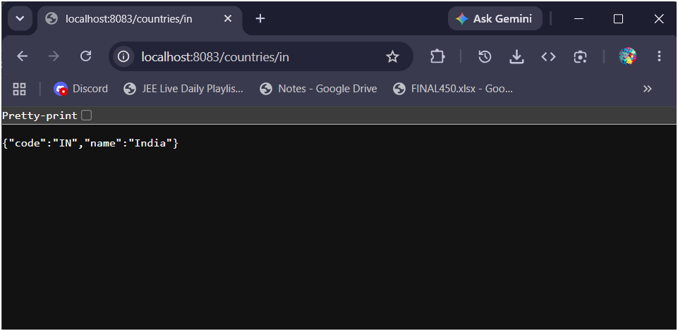
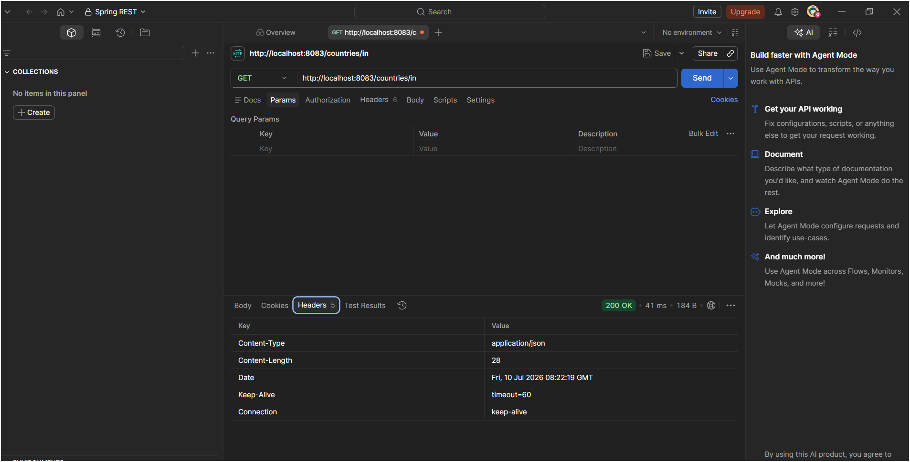

# Exercise 5 - REST - Get Country Based on Country Code

## What this does

A GET REST endpoint that accepts a country code in the URL, looks it up from `country.xml` (Spring bean config), and returns the matching country as JSON. The code matching is case insensitive so `in`, `IN`, `In` all return India.

---

## Files added in spring-learn project

| File | Location in project |
|---|---|
| `Country.java` | `src/main/java/com/cognizant/spring_learn/model/` |
| `CountryService.java` | `src/main/java/com/cognizant/spring_learn/service/` |
| `CountryController.java` | `src/main/java/com/cognizant/spring_learn/controller/` |
| `country.xml` | `src/main/resources/` |

---

## Endpoint details

| | |
|---|---|
| Method | GET |
| URL | http://localhost:8083/countries/{code} |
| Example | http://localhost:8083/countries/in |

---

## Sample Response

```json
{
  "code": "IN",
  "name": "India"
}
```

---

## Countries available to test

| Code | Country |
|---|---|
| IN | India |
| US | United States |
| UK | United Kingdom |
| AU | Australia |
| CA | Canada |

---

## Output Screenshot

### Browser


### Postman

