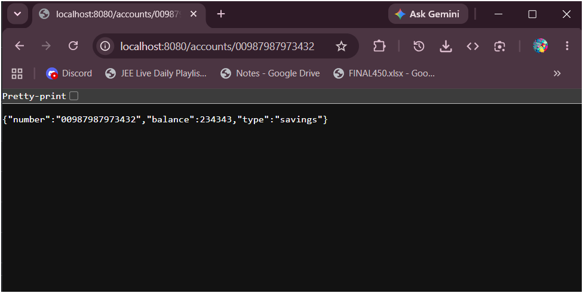
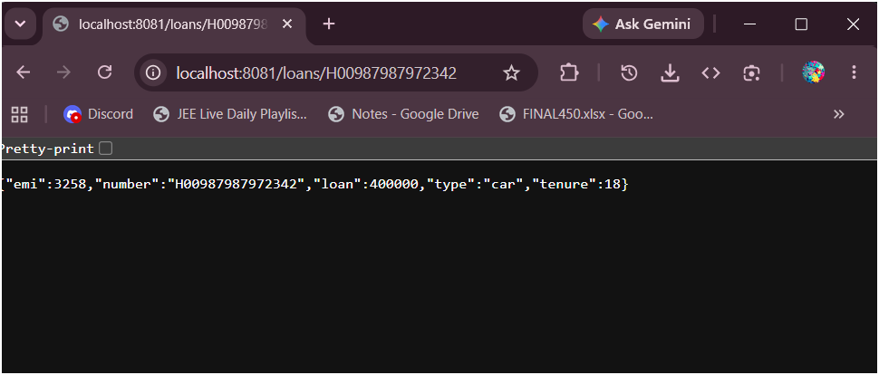

# Week 4 - Microservices - Account and Loan

Two independent Spring Boot microservices running on different ports. No backend connectivity — dummy responses only.

---

## Folder Structure

```
WEEK 4\
└── microservices\
    ├── account\
    │   ├── pom.xml
    │   └── src\main\
    │       ├── java\com\cognizant\account\
    │       │   ├── AccountApplication.java
    │       │   └── controller\
    │       │       └── AccountController.java
    │       └── resources\
    │           └── application.properties      (port 8080)
    │
    └── loan\
        ├── pom.xml
        └── src\main\
            ├── java\com\cognizant\loan\
            │   ├── LoanApplication.java
            │   └── controller\
            │       └── LoanController.java
            └── resources\
                └── application.properties      (port 8081)
```

---

## Endpoints

| Service | Port | URL | Sample Response |
|---|---|---|---|
| Account | 8080 | http://localhost:8080/accounts/00987987973432 | `{"number":"00987987973432","type":"savings","balance":234343}` |
| Loan | 8081 | http://localhost:8081/loans/H00987987972342 | `{"number":"H00987987972342","type":"car","loan":400000,"emi":3258,"tenure":18}` |

---

## Output Screenshots

### Account Service


### Loan Service

