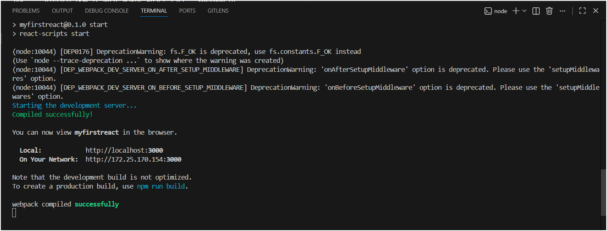
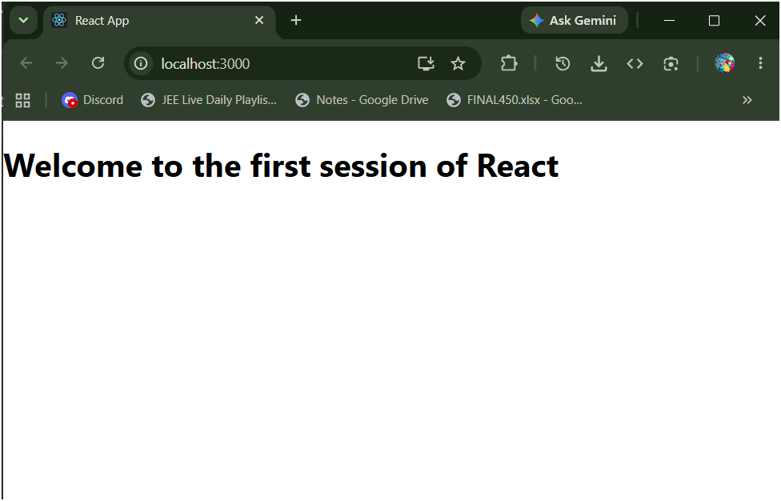

# ReactJS Hands-On Lab: My First React App

This lab is about setting up React for the first time, creating a new app using `create-react-app`, and displaying a heading on the browser. Pretty straightforward once Node.js is installed.

---

## Theory

### What is a SPA?

SPA stands for Single Page Application. Instead of loading a completely new HTML page every time you click something, a SPA just updates the part of the page that changed. Gmail and Facebook are examples — the page never fully reloads when you open an email or scroll the feed.

**Benefits:** faster, feels like a native app, less work for the server.

### SPA vs MPA

| | SPA | MPA |
|---|---|---|
| Page reload | No | Yes, on every navigation |
| Speed | Faster after first load | Slower |
| SEO | Needs extra setup | Works out of the box |

**Pros of SPA:** fast and smooth experience, clear frontend/backend separation.
**Cons of SPA:** initial load can be slow, SEO is harder to handle.

### What is React?

React is a JavaScript library made by Meta (Facebook) for building UIs. You break the UI into small reusable pieces called **components**. Each component manages its own content and can be reused anywhere.

### What is Virtual DOM?

The browser's real DOM is slow to update. React keeps a Virtual DOM — a lightweight copy of the real DOM in memory. When something changes, React:
1. Updates the Virtual DOM
2. Compares it with the old Virtual DOM (diffing)
3. Only updates the actual parts that changed in the real DOM (reconciliation)

This makes React much faster than updating the DOM manually.

### Features of React

- **Components** — reusable UI building blocks
- **JSX** — write HTML inside JavaScript
- **Virtual DOM** — fast UI updates
- **One-way data flow** — data moves in one direction, easier to debug
- **Hooks** — manage state inside functional components

---

## App.js

This is the only file that was modified. The original content was deleted and replaced with:

```jsx
import React from 'react';

function App() {
  return (
    <div>
      <h1>Welcome to the first session of React</h1>
    </div>
  );
}

export default App;
```

The `<h1>` tag renders the heading on the page. JSX looks like HTML but it's actually JavaScript — Babel converts it before the browser runs it.

---

## Steps I Followed

**1. Checked Node.js and npm were installed:**
```
node -v
npm -v
```

**2. Created the React app:**
```
npx create-react-app myfirstreact
```
This took a few minutes to download everything.

**3. Navigated into the folder:**
```
cd myfirstreact
```

**4. Opened in VS Code:**
```
code .
```

**5. Replaced content of `src/App.js`** with the code above and saved.

**6. Started the app:**
```
npm start
```

Browser opened automatically at `http://localhost:3000`.

---

## Output

### Terminal — after npm start



### Browser — localhost:3000




### Observation

The app compiled and opened at `localhost:3000` showing the heading. Any change saved in `App.js` reflected in the browser instantly without refreshing — that's React's hot reload.

---

## Folder Structure

```
myfirstreact/
├── public/
│   └── index.html       ← the single HTML file (has <div id="root">)
├── src/
│   ├── App.js           ← modified this file
│   └── index.js         ← mounts App into the root div
├── package.json
└── node_modules/        ← all dependencies, don't touch
```

---

## What I Learned

- `create-react-app` sets everything up automatically — no manual Webpack or Babel config needed.
- JSX looks like HTML but is JavaScript under the hood. `<h1>Hello</h1>` gets converted to `React.createElement('h1', null, 'Hello')` by Babel.
- `npm start` runs a dev server with hot reload — saves a lot of time while developing.
- `node_modules` is huge (100MB+) and should never be committed to Git. `create-react-app` adds it to `.gitignore` automatically.
- The whole app is served from a single `index.html` — React injects the component output into the `<div id="root">` inside it. That's what makes it a Single Page Application.