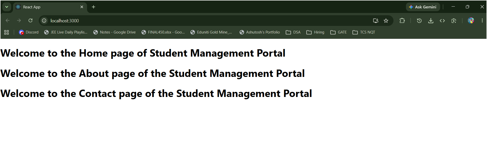
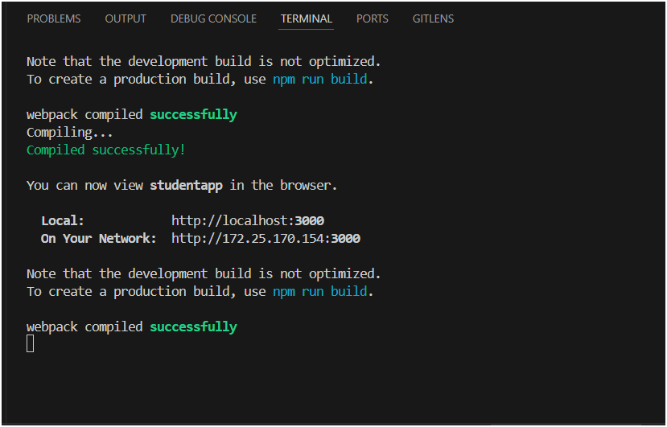

# ReactJS Hands-On Lab 2: Student Management Portal Components

This lab is about creating React class components and rendering multiple components together. I created a StudentApp with three separate components — Home, About, and Contact — and called all three from `App.js`.

---

## Theory

### What is a React Component?

A component is a reusable, self-contained piece of UI. Instead of writing all HTML in one big file, you split it into small components, each responsible for one part of the screen. You can then combine them to build the full page.

**Component vs JavaScript Function:**

| | Component | Regular JS Function |
|---|---|---|
| Returns | JSX (UI) | Any value |
| Can have state | Yes | No (unless using Hooks) |
| Lifecycle methods | Yes (class components) | No |
| Used in JSX | Yes (`<MyComponent />`) | No |

### Types of Components

**Class Component** — older style, uses ES6 class syntax, has `render()` method and access to lifecycle methods like `componentDidMount()`.

**Function Component** — newer style, simpler, just a function that returns JSX. With Hooks (`useState`, `useEffect`) you can do everything a class component does.

This lab uses **class components** since the exercise specifically asks for them.

### Class Component Structure

```jsx
import React, { Component } from 'react';

class MyComponent extends Component {
  constructor(props) {
    super(props);
    // initialize state here if needed
  }

  render() {
    return (
      <div>
        <h1>Hello</h1>
      </div>
    );
  }
}

export default MyComponent;
```

- **`constructor(props)`** — called when the component is first created. Used to initialize state. `super(props)` must be called first.
- **`render()`** — the only required method in a class component. Returns the JSX that gets displayed on screen.
- **`export default`** — makes the component importable in other files.

### What is render()?

`render()` is what React calls to figure out what to show on screen. Every time state or props change, React calls `render()` again and updates just the parts that changed (via Virtual DOM diffing).

---

## Files Created

| File | What it does |
|---|---|
| `src/Components/Home.js` | Class component showing Home page message |
| `src/Components/About.js` | Class component showing About page message |
| `src/Components/Contact.js` | Class component showing Contact page message |
| `src/App.js` | Imports all three and renders them together |

---

## Steps I Followed

**1. Created the React app:**
```
npx create-react-app studentapp
```

**2. Navigated into the folder:**
```
cd studentapp
```

**3. Created a `Components` folder inside `src`:**

In VS Code Explorer → right-click `src` → New Folder → name it `Components`

**4. Created `Home.js` inside `src/Components/`** with this code:

```jsx
import React, { Component } from 'react';

class Home extends Component {
  render() {
    return (
      <div>
        <h1>Welcome to the Home page of Student Management Portal</h1>
      </div>
    );
  }
}

export default Home;
```

**5. Created `About.js` inside `src/Components/`:**

```jsx
import React, { Component } from 'react';

class About extends Component {
  render() {
    return (
      <div>
        <h1>Welcome to the About page of the Student Management Portal</h1>
      </div>
    );
  }
}

export default About;
```

**6. Created `Contact.js` inside `src/Components/`:**

```jsx
import React, { Component } from 'react';

class Contact extends Component {
  render() {
    return (
      <div>
        <h1>Welcome to the Contact page of the Student Management Portal</h1>
      </div>
    );
  }
}

export default Contact;
```

**7. Updated `App.js`** to import and render all three components:

```jsx
import React from 'react';
import Home from './Components/Home';
import About from './Components/About';
import Contact from './Components/Contact';

function App() {
  return (
    <div>
      <Home />
      <About />
      <Contact />
    </div>
  );
}

export default App;
```

**8. Started the app:**
```
npm start
```

**9. Opened browser at `localhost:3000`** — all three messages showed on the page.

---

## How to Run (if setting up fresh)

**Step 1 — Navigate to the target folder:**
```
cd "C:\Users\himan\OneDrive\Desktop\Tanishi\Programming\CognizantHandsOn\WEEK 5\2. ReactJS-HOL"
```

**Step 2 — Create the React app:**
```
npx create-react-app studentapp
```

**Step 3 — Go into studentapp:**
```
cd studentapp
```

**Step 4 — Open in VS Code:**
```
code .
```

**Step 5 — Create the Components folder** inside `src` (right-click `src` in VS Code Explorer → New Folder → `Components`)

**Step 6 — Place the 4 files** from this folder into their correct locations:
- `Home.js`, `About.js`, `Contact.js` → `src/Components/`
- `App.js` → replace the existing `src/App.js`

**Step 7 — Run:**
```
npm start
```

Browser opens at `http://localhost:3000` automatically.

---

## Output

### Browser — all three components rendered




### Terminal — npm start output



### Observation

All three class components rendered on the page in the order they were called in `App.js` — Home first, then About, then Contact. Each component is completely independent and manages its own content. `App.js` just imports and renders them using JSX tags (`<Home />`, `<About />`, `<Contact />`).

---

## Folder Structure

```
studentapp/
├── public/
│   └── index.html
├── src/
│   ├── App.js               ← modified - calls all 3 components
│   ├── Components/          ← created this folder manually
│   │   ├── Home.js
│   │   ├── About.js
│   │   └── Contact.js
│   └── index.js
├── package.json
└── node_modules/
```

---

## What I Learned

- Class components need to extend `Component` from React and must have a `render()` method — without `render()`, React doesn't know what to show.
- `constructor(props)` and `super(props)` are needed when initializing state in a class component. For this exercise we didn't need state so the constructor was skipped.
- Components are called in JSX using self-closing tags like `<Home />`. The name must start with a capital letter — lowercase names are treated as plain HTML elements.
- Organizing components in a separate `Components` folder inside `src` is standard practice. It keeps things clean as the project grows.
- `export default` at the bottom of each file makes the component importable. `import Home from './Components/Home'` in `App.js` then pulls it in.
- The import path `'./Components/Home'` is relative to `App.js` which sits in `src/`. No `.js` extension needed in the import — React handles that.