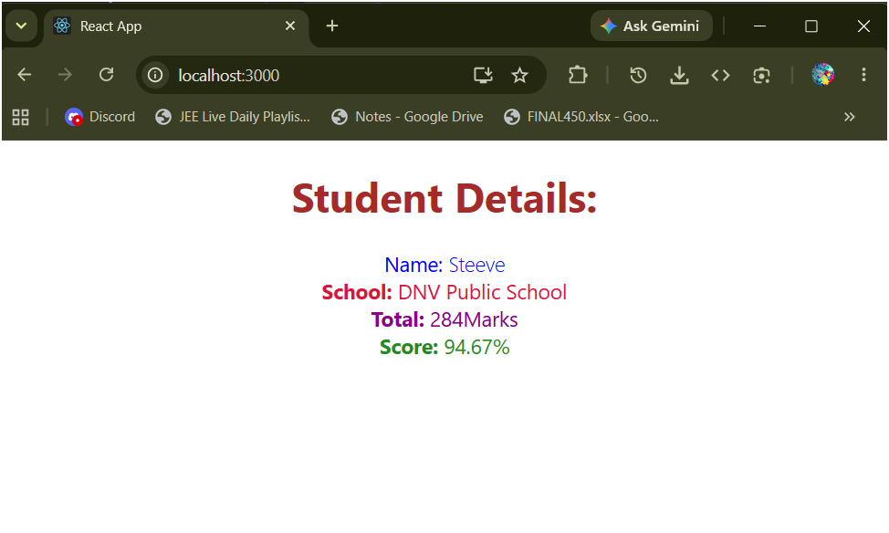

# HOL 3 - React Function Component - Score Calculator

## What this does

A React function component `CalculateScore` that accepts Name, School, Total marks and goal (number of subjects) as props, calculates the average score percentage and displays student details with CSS styling.

---

## Folder Structure

```
scorecalculatorapp\
└── src\
    ├── App.js
    ├── components\
    │   └── CalculateScore.js
    └── Stylesheets\
        └── mystyle.css
```

---

## Expected Output

```
Student Details:
Name: Steeve
School: DNV Public School
Total: 284 Marks
Score: 94.67%
```

---

## Output Screenshot

