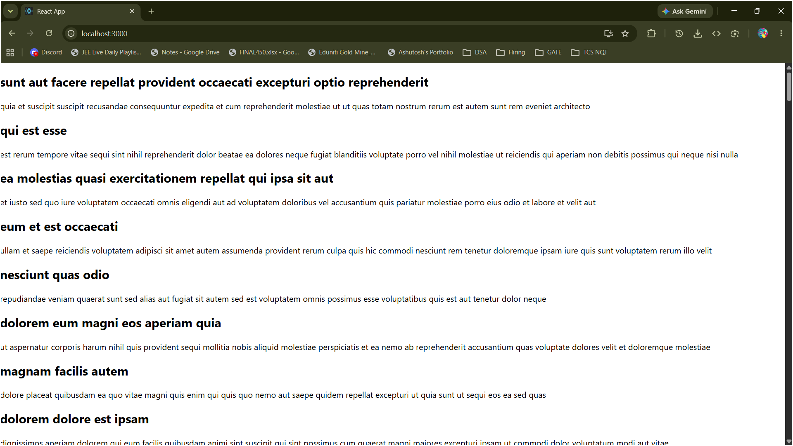

# HOL 4 - React Class Component - Blog App

## What this does

A React class-based component `Posts` that uses `componentDidMount()` to fetch posts from a public API and displays them as headings and paragraphs. Also implements `componentDidCatch()` for error handling.

---

## Folder Structure

```
blogapp\
└── src\
    ├── App.js
    ├── Post.js
    └── Posts.js
```

---

## Key concepts covered

| Concept | Where |
|---|---|
| Class component | `Posts` class in `Posts.js` |
| Component constructor + state | initializes with default post |
| `componentDidMount()` | calls `loadPosts()` after component renders |
| Fetch API | loads posts from jsonplaceholder |
| `componentDidCatch()` | catches and alerts any render errors |
| `render()` | displays title as `<h2>` and body as `<p>` |

---

## API Used

```
https://jsonplaceholder.typicode.com/posts
```

Returns 100 dummy posts with id, title, body.

---

## Expected Output

Browser at `localhost:3000` shows a list of 100 posts each with a heading and paragraph.

---

## Output Screenshot

