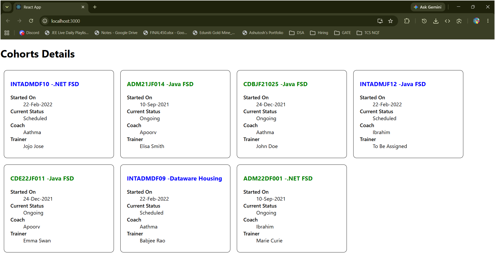

# HOL 5 - React Styling - Cohort Tracker

## What this does

Displays a dashboard of cohort details using CSS Modules for the box layout and inline styles for conditional color — green when status is "Ongoing", blue for all other statuses.

---

## Folder Structure

```
cohorttracker\
└── src\
    ├── App.js
    ├── Cohort.js
    ├── CohortDetails.js
    └── CohortDetails.module.css
```

---

## Key concepts covered

| Concept | Where |
|---|---|
| CSS Module | `CohortDetails.module.css` — `.box` class applied via `styles.box` |
| Tag selector in CSS Module | `dt` element styled with `font-weight: 500` |
| Inline conditional style | `currentStatus === 'Ongoing'` → green, else blue |
| Props | cohortCode, technology, startDate, currentStatus, coach, trainer |
| Array map | `CohortsData.map()` in App.js renders all cohorts dynamically |

---

## Cohorts Data

| Cohort Code | Technology | Status |
|---|---|---|
| INTADMDF10 | .NET FSD | Scheduled |
| ADM21JF014 | Java FSD | Ongoing |
| CDBJF21025 | Java FSD | Ongoing |
| INTADMJF12 | Java FSD | Scheduled |
| CDE22JF011 | Java FSD | Ongoing |
| INTADMDF09 | Dataware Housing | Scheduled |
| ADM22DF001 | .NET FSD | Ongoing |

---

## Expected Output

7 cohort cards displayed with:
- Ongoing status in **green**
- Scheduled status in **blue**
- Each card in a bordered box with rounded corners

---

## Output Screenshot

